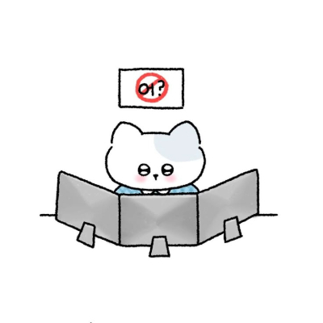

# 1주차 회고

## 멋사 14기 한 주를 마치면서

드디어 기다리던 멋사 프론트엔드 부트캠프 첫째 주!

잘 적응할 수 있을지 걱정이 무색하게 시간이 흘러 벌써 주말을 맞이했다.

## 슬비쌤과의 만남!

솔직히 한 강사님이 오전, 오후 풀타임으로 강의를 진행하시게 될 거라고는 상상도 못했다. 그만큼 장시간 말하며 누군가를 가르친다는 일은 체력적으로나 정신적으로나 극한의 일이기 때문이다.

그러나 **슬비쌤**은 홀로 그 광활한 오디오를 채우시면서 조금이라도 텐션이 떨어지거나 지치는 기색이 보이지 않으셨다. 오히려 강의가 끝나도 질문에 답해주시는 모습에는 경외심마저 들었다. (혹시... _AI...?_)

강의는 내 예상과는 조금 다르게 신경쓸 게 많고 놓치고 있던 부분을 확인할 수 있는 시간이었다. 특히 평소 등한시하던 **웹 접근성**이라는 개념에 대해 다시 생각하게 되었다. 보이는 게 다가 아니다라는 걸 뼈저리게 느낀 대목이다.

연습할 땐 _어차피 서비스할 거 아니니까~_ 라는 마음으로 대체 텍스트나 유니버설 디자인에는 많은 신경을 못 썼는데 선생님이 그런 안 좋은 습관들을 날카롭게 캐치하셔서 찔렸다...

## 잘했던 점

- 누구보다 아침잠이 많은 내가 지각 없이 첫 주를 끝마쳤다는 점
- 9시 회고가 끝난 후에도 자습을 이어나갔다는 점
- 팀원들의 질문에 잘 알려주었다는 점

## 보완할 점

- 지각은 없었으나 대부분 아슬아슬했다는 점...
- 아는 내용에는 조금 긴장을 푼다는 점

## 다음 주 나와의 약속

- 수업 시작 1시간 전부터 자습하기(8:00 ~ 9:00)
- 매일매일 회고록 쓰기
- 일찍 자기

## 마치며

긴 과정의 시작일 뿐이지만 그래도 첫 단추는 잘 잠궜다고 생각한다.

입과하기 전, 그리고 진로를 결심했을 때 내가 어떤 마음이었는지 항상 상기하며 마지막까지 과정을 잘 수료해보려 한다. **화이팅!**
